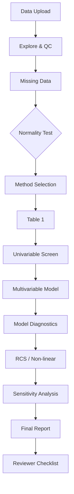
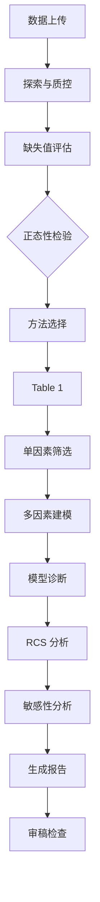

# 🏥 Claude Medical Statistics Skill

> A comprehensive biostatistics companion for Claude Code — reviewed from the perspective of **The Lancet, BMJ, NEJM, and JAMA** statistical reviewers.

[中文版](#-中文版)

---

## Overview

This skill transforms Claude Code into a **rigorous biomedical statistician** capable of:

- Complete clinical data analysis pipeline (exploration → modeling → reporting)
- Journal-grade statistical methodology selection and justification
- Reviewer-aware reporting compliant with **STROBE**, **CONSORT**, **STARD**, and **TRIPOD** guidelines
- Interactive method selection with statistical peer-review feedback
- **Python and R bilingual** — user chooses their preferred language at start; analysis waits for confirmation

## Core Capabilities

| Domain | Methods |
|:-------|:--------|
| Descriptive | Normality tests, Table 1 (baseline characteristics), standardized mean differences |
| Univariable | t-test, Wilcoxon, ANOVA, Kruskal-Wallis, χ², Fisher's exact, McNemar |
| Multivariable | Linear / Logistic / Cox / Ordinal / Multinomial / Poisson regression |
| **Visualization** | **Forest plot (OR/HR/β+95%CI+P-value), RCS curve, KM curve, Love Plot** |
| Non-linear | Restricted Cubic Splines (RCS), smooth curves, threshold effect analysis |
| Survival | Kaplan-Meier, Cox PH, competing risks, landmark analysis, time-dependent ROC |
| Advanced | Propensity score (PSM, IPTW), mediation analysis, DAG-based causal inference |
| Diagnostics | ROC/AUC, calibration, C-statistic, net reclassification improvement (NRI) |
| Sensitivity | E-value, multiple imputation, subgroup analysis, interaction tests |
| Agreement | Bland-Altman, Cohen's κ, intraclass correlation (ICC) |

## Installation

```bash
# User-level install (available across all projects)
git clone https://github.com/ablikimeli/claude-medical-stats.git ~/.claude/skills/medical-statistics

# Or project-level install
git clone https://github.com/ablikimeli/claude-medical-stats.git .claude/skills/medical-statistics
```

## Usage

```
/medical-statistics
```

Or simply describe your data and analysis needs — the skill auto-triggers on keywords like:
*"Please analyze my clinical data"*, *"Run a multivariable analysis"*, *"Check nonlinear relationships"*, *"Generate Table 1"*, *"Survival analysis needed"*

## Dependencies

**Python and R are both available.** The skill asks which engine to use at the start — analysis only proceeds after user confirmation.

- **Python**: `pandas`, `numpy`, `scipy`, `statsmodels`, `lifelines`, `scikit-learn`, `matplotlib`, `seaborn`,
  `patsy`, `openpyxl`, `python-docx`
  - `D:\software\Python314\python.exe`
- **R**: `tableone`, `rms`, `Hmisc`, `ggplot2`, `survival`, `MatchIt`, `openxlsx`, `officer`, `flextable`
  - `D:\software\R-4.5.2\bin\Rscript.exe`
  - Note: some R packages (e.g. `dplyr`) may have environment-specific issues; falls back to Python if execution fails

## Export Features

All analysis outputs are available in publication-ready formats:

| Format | Tables | Figures |
|:-------|:-------|:--------|
| **CSV** (.csv) | Raw data tables — Table 1, regression, RCS predictions | — |
| **Excel** (.xlsx) | Table 1, regression results, RCS predictions | — |
| **Word** (.docx) | Formatted tables ready for manuscript | — |
| **PNG** (.png, 300 DPI) | — | Forest / RCS / ROC / KM / Love Plot |
| **PDF** (.pdf) | — | Vector figures for publication |

## File Structure

```
medical-statistics/
├── SKILL.md                          # Skill definition & workflow
├── FORMS.md                          # Interaction templates
├── README.md                         # This file
├── scripts/
│   ├── normality_test.{R,py}         # Normality assessment + Excel export
│   ├── table_one.{R,py}              # Baseline characteristics + Word/Excel export
│   ├── multivariate_analysis.{R,py}  # Regression models + Word/Excel export
│   ├── rcs_analysis.{R,py}           # Restricted cubic splines + PDF/PNG/Excel export
│   ├── utils.{R,py}                  # Utility functions
│   └── export_utils.{R,py}           # Export functions (Word/Excel/PDF/PNG)
├── references/
│   ├── statistical_methods_reference.md  # Comprehensive method guide
│   └── rcs_guide.md                     # RCS deep reference
└── evals/
    └── evals.json                    # Test cases
```

## Statistical Review Process



## Reporting Standards

This skill enforces key elements from:

- **STROBE** — Strengthening the Reporting of Observational Studies in Epidemiology
- **CONSORT** — Consolidated Standards of Reporting Trials
- **STARD** — Standards for Reporting Diagnostic Accuracy Studies
- **TRIPOD** — Transparent Reporting of a multivariable prediction model for Individual Prognosis Or Diagnosis

---

## 🌏 中文版

# 🏥 医学统计分析 Claude Code Skill

> 从《柳叶刀》、《BMJ》、《新英格兰医学杂志》、《JAMA》统计审稿人角度打造的生物统计学技能。

### 核心功能

- **完整临床数据分析流程**：数据探索 → 建模 → 报告
- **顶级期刊级统计方法选择与论证**
- **符合 STROBE/CONSORT/STARD/TRIPOD 报告规范**
- **交互式方法选择**：推荐方法 → 用户确认 → 自定义方法评估
- **统计审稿检查清单**：从审稿人角度检查分析质量
- **Python / R 双语支持**：启动时询问用户选择，确认后再执行分析

### 支持的方法

| 类别 | 方法 |
|:-----|:------|
| 描述统计 | 正态性检验、Table 1、SMD |
| 单因素 | t检验、Wilcoxon、ANOVA、Kruskal-Wallis、χ²、Fisher |
| 多因素 | 线性/Logistic/Cox/有序/多项/Poisson回归 |
| 非线性 | 限制性立方样条(RCS)、平滑曲线、阈值效应 |
| 生存分析 | Kaplan-Meier、Cox PH、竞争风险、landmark分析 |
| 高级方法 | 倾向评分(PSM, IPTW)、中介分析、DAG因果推断 |
| 诊断试验 | ROC/AUC、校准曲线、C-statistic、NRI |
| 敏感性 | E-value、多重插补、亚组分析、交互作用 |

### 输出导出

所有分析结果自动导出为可发表格式：

| 输出类型 | 格式 | 说明 |
|:---------|:-----|:------|
| 统计数据 | **CSV** (.csv) | Table 1、回归结果、RCS 预测原始数据 |
| 统计表格 | **Excel** (.xlsx) | Table 1、回归结果、RCS 预测数据 |
| 统计表格 | **Word** (.docx) | 格式化表格，可直接粘贴到论文 |
| 统计图形 | **PNG** (.png, 300 DPI) | 森林图/RCS/ROC/KM/Love Plot |
| 统计图形 | **PDF** (.pdf) | 矢量格式，适合投稿和印刷 |

### 安装

```bash
git clone https://github.com/ablikimeli/claude-medical-stats.git ~/.claude/skills/medical-statistics
```

### 语言选择

- **未指定** → 必须询问用户选择 Python 还是 R
- 用户指定 **"用 Python"** → 使用 Python 引擎
- 用户指定 **"用 R"** → 尝试 R 引擎（部分依赖可能不可用，失败则回退到 Python）

### 文件结构

```text
medical-statistics/
├── SKILL.md                          # 技能定义与工作流
├── FORMS.md                          # 交互模板
├── README.md                         # 本文件
├── scripts/
│   ├── normality_test.{R,py}         # 正态性检验 + Excel导出
│   ├── table_one.{R,py}              # 基线特征表 + Word/Excel导出
│   ├── multivariate_analysis.{R,py}  # 多因素回归 + Word/Excel导出
│   ├── rcs_analysis.{R,py}           # 限制性立方样条 + PDF/PNG/Excel导出
│   ├── utils.{R,py}                  # 工具函数
│   └── export_utils.{R,py}           # 导出功能（Word/Excel/PDF/PNG）
├── references/
│   ├── statistical_methods_reference.md  # 统计方法手册
│   └── rcs_guide.md                     # RCS 深度参考
└── evals/
    └── evals.json                    # 测试用例
```

### 统计分析流程



### 使用

直接说中文：
- *"帮我做统计分析"*
- *"跑一下Table 1"*
- *"做多因素分析"*
- *"看看这个变量和结局的非线性关系"*
- *"生存分析"*

---

---

## 🌏 日本語

# 🏥 医学統計分析 Claude Code Skill

> *The Lancet・BMJ・NEJM・JAMA* の統計レビュアー視点で作られた医用統計解析ツール。

### 概要

Claude Code 上で対話的に臨床データ分析を実行。データ取込から品質管理、正規性検定、Table 1、単変量・多変量解析、RCS非線形分析、傾向スコア、感度分析まで、一貫したパイプラインを提供。

### 使用方法

```
/medical-statistics
```

または自然言語で依頼：「この臨床データを分析して」「Table 1 を出力」「多変量解析をお願い」

### 言語選択

- **指定なし** → 起動時に Python か R かを確認
- **Python** を指定 → Python エンジンで実行
- **R** を指定 → R エンジンを試行（一部パッケージに既知の問題あり、失敗時は Python にフォールバック）

### 依存環境

- **Python**: `D:\software\Python314\python.exe`
- **R**: `D:\software\R-4.5.2\bin\Rscript.exe`

詳細な機能一覧と出力形式については[英語版](#-claude-medical-statistics-skill)を参照。

---

## 한국어

# 🏥 의학 통계 분석 Claude Code Skill

> *Lancet・BMJ・NEJM・JAMA* 통계 리뷰어 관점에서 제작된 의학 통계 분석 도구입니다.

### 개요

Claude Code에서 대화식으로 임상 데이터 분석을 수행합니다. 데이터 불러오기, 품질 관리, 정규성 검정, Table 1, 단변량/다변량 분석, RCS 비선형 분석, 성향 점수 분석, 민감도 분석까지 일관된 파이프라인을 제공합니다.

### 사용 방법

```
/medical-statistics
```

또는 자연어로 요청: "이 임상 데이터를 분석해 주세요", "Table 1을 출력해 주세요"

### 언어 선택

- **지정 없음** → 시작 시 Python 또는 R 선택 확인
- **Python 지정** → Python 엔진으로 실행
- **R 지정** → R 엔진 시도 (일부 패키지에 문제 있을 수 있음, 실패 시 Python으로 대체)

### 의존 환경

- **Python**: `D:\software\Python314\python.exe`
- **R**: `D:\software\R-4.5.2\bin\Rscript.exe`

자세한 기능 목록과 출력 형식은 [영어版](#-claude-medical-statistics-skill)을 참조하세요.

---

## Español

# 🏥 Skill de Estadística Médica para Claude Code

> Una herramienta integral de bioestadística creada desde la perspectiva de revisores estadísticos de *The Lancet, BMJ, NEJM y JAMA*.

### Descripción

Realiza análisis de datos clínicos de forma interactiva en Claude Code. El pipeline completo incluye: importación de datos, control de calidad, pruebas de normalidad, Tabla 1, análisis univariable y multivariable, splines cúbicos restringidos (RCS), puntuación de propensión, análisis de sensibilidad, y más.

### Uso

```
/medical-statistics
```

O simplemente describe tu necesidad: "Analiza estos datos clínicos", "Genera la Tabla 1", "Haz un análisis multivariable"

### Selección de lenguaje

- **No especificado** → Pregunta al inicio si usar Python o R
- **Python** → Ejecuta con el motor de Python
- **R** → Intenta con R (algunos paquetes pueden tener problemas; fallback a Python si falla)

### Dependencias

- **Python**: `D:\software\Python314\python.exe`
- **R**: `D:\software\R-4.5.2\bin\Rscript.exe`

Para la lista completa de capacidades y formatos de exportación, consulta la [versión en inglés](#-claude-medical-statistics-skill).

---

**Author**: [ablikimeli](https://github.com/ablikimeli) | **License**: MIT
