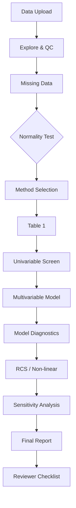
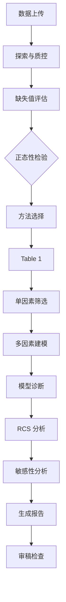

# 🏥 Claude Medical Statistics Skill

> A comprehensive biostatistics companion for Claude Code — reviewed from the perspective of **The Lancet, BMJ, NEJM, and JAMA** statistical reviewers.

[中文版](#-中文版)

---

## Overview

This skill transforms Claude Code into a **rigorous biomedical statistician** capable of:

- Complete clinical data analysis pipeline (exploration → modeling → reporting)
- Journal-grade statistical methodology selection and justification
- Reviewer-aware reporting compliant with **STROBE**, **CONSORT**, **STARD**, and **TRIPOD** guidelines
- Interactive method selection with statistical peer-review feedback
- **R and Python bilingual** — choose your preferred language

## Core Capabilities

| Domain | Methods |
|:-------|:--------|
| Descriptive | Normality tests, Table 1 (baseline characteristics), standardized mean differences |
| Univariable | t-test, Wilcoxon, ANOVA, Kruskal-Wallis, χ², Fisher's exact, McNemar |
| Multivariable | Linear / Logistic / Cox / Ordinal / Multinomial / Poisson regression |
| Non-linear | Restricted Cubic Splines (RCS), smooth curves, threshold effect analysis |
| Survival | Kaplan-Meier, Cox PH, competing risks, landmark analysis, time-dependent ROC |
| Advanced | Propensity score (PSM, IPTW), mediation analysis, DAG-based causal inference |
| Diagnostics | ROC/AUC, calibration, C-statistic, net reclassification improvement (NRI) |
| Sensitivity | E-value, multiple imputation, subgroup analysis, interaction tests |
| Agreement | Bland-Altman, Cohen's κ, intraclass correlation (ICC) |

## Installation

```bash
# User-level install (available across all projects)
git clone https://github.com/ablikimeli/claude-medical-stats.git ~/.claude/skills/medical-statistics

# Or project-level install
git clone https://github.com/ablikimeli/claude-medical-stats.git .claude/skills/medical-statistics
```

## Usage

```
/medical-statistics
```

Or simply describe your data and analysis needs — the skill auto-triggers on keywords like:
*"Please analyze my clinical data"*, *"Run a multivariable analysis"*, *"Check nonlinear relationships"*, *"Generate Table 1"*, *"Survival analysis needed"*

## Dependencies

**Both R and Python are supported.** The skill asks which language you prefer if not specified.

- **R** ≥ 4.0 (default): `tableone`, `rms`, `Hmisc`, `ggplot2`, `dplyr`, `survival`, `mice`, `MatchIt`, `mediation`
  - `D:\software\R-4.5.2\bin\Rscript.exe`
- **Python**: `pandas`, `numpy`, `scipy`, `statsmodels`, `lifelines`, `scikit-learn`, `matplotlib`, `seaborn`, `pingouin`, `patsy`
  - `D:\software\Python314\python.exe`

## File Structure

```
medical-statistics/
├── SKILL.md                          # Skill definition & workflow
├── FORMS.md                          # Interaction templates
├── README.md                         # This file
├── scripts/
│   ├── normality_test.R              # Normality assessment
│   ├── table_one.R                   # Baseline characteristics
│   ├── multivariate_analysis.R       # Regression models
│   └── rcs_analysis.R                # Restricted cubic splines
├── references/
│   ├── statistical_methods_reference.md  # Comprehensive method guide
│   └── rcs_guide.md                     # RCS deep reference
└── evals/
    └── evals.json                    # Test cases
```

## Statistical Review Process



## Reporting Standards

This skill enforces key elements from:

- **STROBE** — Strengthening the Reporting of Observational Studies in Epidemiology
- **CONSORT** — Consolidated Standards of Reporting Trials
- **STARD** — Standards for Reporting Diagnostic Accuracy Studies
- **TRIPOD** — Transparent Reporting of a multivariable prediction model for Individual Prognosis Or Diagnosis

---

## 🌏 中文版

# 🏥 医学统计分析 Claude Code Skill

> 从《柳叶刀》、《BMJ》、《新英格兰医学杂志》、《JAMA》统计审稿人角度打造的生物统计学技能。

### 核心功能

- **完整临床数据分析流程**：数据探索 → 建模 → 报告
- **顶级期刊级统计方法选择与论证**
- **符合 STROBE/CONSORT/STARD/TRIPOD 报告规范**
- **交互式方法选择**：推荐方法 → 用户确认 → 自定义方法评估
- **统计审稿检查清单**：从审稿人角度检查分析质量

### 支持的方法

| 类别 | 方法 |
|:-----|:------|
| 描述统计 | 正态性检验、Table 1、SMD |
| 单因素 | t检验、Wilcoxon、ANOVA、Kruskal-Wallis、χ²、Fisher |
| 多因素 | 线性/Logistic/Cox/有序/多项/Poisson回归 |
| 非线性 | 限制性立方样条(RCS)、平滑曲线、阈值效应 |
| 生存分析 | Kaplan-Meier、Cox PH、竞争风险、landmark分析 |
| 高级方法 | 倾向评分(PSM, IPTW)、中介分析、DAG因果推断 |
| 诊断试验 | ROC/AUC、校准曲线、C-statistic、NRI |
| 敏感性 | E-value、多重插补、亚组分析、交互作用 |

### 安装

```bash
git clone https://github.com/ablikimeli/claude-medical-stats.git ~/.claude/skills/medical-statistics
```

### 统计分析流程



### 使用

直接说中文：
- *"帮我做统计分析"*
- *"跑一下Table 1"*
- *"做多因素分析"*
- *"看看这个变量和结局的非线性关系"*
- *"生存分析"*

---

**Author**: [ablikimeli](https://github.com/ablikimeli) | **License**: MIT
